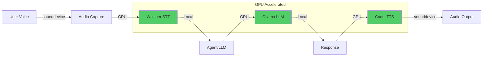

# Implementation Plan: Hardware-Accelerated Audio Pipeline

## Executive Summary

This plan outlines the migration from cloud-based audio processing to a fully hardware-accelerated local pipeline using GPU/Metal acceleration for STT, TTS, and LLM inference.

**Timeline:** 2-3 weeks
**Complexity:** High
**Impact:** 5-20x performance improvement, offline capability, cost reduction

---

## Current State Analysis

### Existing Architecture


**Issues:**
- ❌ No hardware acceleration
- ❌ Cloud-dependent (requires internet)
- ❌ High latency (network round-trips)
- ❌ Ongoing API costs
- ❌ Privacy concerns (data leaves device)
- ❌ Platform-specific playback (macOS only)

---

## Target Architecture

### Hardware-Accelerated Pipeline



**Benefits:**
- ✅ Full GPU/Metal acceleration
- ✅ Offline operation
- ✅ 5-20x lower latency
- ✅ No API costs
- ✅ Privacy (data stays local)
- ✅ Cross-platform support

---

## Implementation Phases

### Phase 1: Foundation & Configuration (Week 1, Days 1-2)

#### 1.1 Hardware Detection & Configuration System

**Goal:** Create a robust system to detect and configure hardware acceleration

**New Files:**
- `src/intuit/hardware/__init__.py`
- `src/intuit/hardware/detector.py` - Hardware capability detection
- `src/intuit/hardware/config.py` - Hardware configuration management
- `src/intuit/config/__init__.py`
- `src/intuit/config/audio_config.py` - Audio pipeline configuration

**Tasks:**
- [ ] Create hardware detection module with CUDA/MPS/CPU detection
- [ ] Implement configuration system with Pydantic models
- [ ] Add environment variable support (.env integration)
- [ ] Create configuration validation and defaults
- [ ] Add comprehensive logging for hardware detection
- [ ] Write unit tests for hardware detection

**Acceptance Criteria:**
- Hardware detection works on CUDA, MPS, and CPU
- Configuration can be loaded from environment variables
- Proper fallback when GPU unavailable
- All tests pass

---

### Phase 2: Speech-to-Text Migration (Week 1, Days 3-5)

#### 2.1 Whisper Integration

**Goal:** Replace Google Speech Recognition with hardware-accelerated Whisper

**New Files:**
- `src/intuit/audio/__init__.py`
- `src/intuit/audio/stt_base.py` - STT base class
- `src/intuit/audio/stt_whisper.py` - Whisper STT implementation
- `src/intuit/audio/stt_google.py` - Google STT (refactored for fallback)
- `src/intuit/audio/stt_factory.py` - STT provider factory

**Modified Files:**
- `src/intuit/ui/voice.py` - Update to use STT factory
- `src/intuit/dictation.py` - Update to use STT factory

**Tasks:**
- [ ] Create STT base class with abstract interface
- [ ] Implement Whisper STT provider with GPU support
- [ ] Add audio preprocessing (resampling to 16kHz, normalization)
- [ ] Refactor existing Google STT into provider pattern
- [ ] Create STT factory for provider selection
- [ ] Update voice interface to use new STT system
- [ ] Update dictation mode to use new STT system
- [ ] Add performance metrics logging (latency, accuracy)
- [ ] Write unit tests for all STT providers
- [ ] Write integration tests for voice interface

**Acceptance Criteria:**
- Whisper STT works with GPU acceleration
- Fallback to Google STT when configured
- Voice interface maintains existing functionality
- Dictation mode works with new STT
- Performance improvement of 5-10x over Google API
- All tests pass

---

### Phase 3: Text-to-Speech Migration (Week 2, Days 1-3)

#### 3.1 Coqui TTS Integration

**Goal:** Replace gTTS with hardware-accelerated Coqui TTS

**New Files:**
- `src/intuit/audio/tts_base.py` - TTS base class
- `src/intuit/audio/tts_coqui.py` - Coqui TTS implementation
- `src/intuit/audio/tts_gtts.py` - gTTS (refactored for fallback)
- `src/intuit/audio/tts_factory.py` - TTS provider factory
- `src/intuit/audio/audio_player.py` - Cross-platform audio playback

**Modified Files:**
- `src/intuit/voice.py` - Update to use TTS factory
- `src/intuit/ui/voice.py` - Update to use new audio player

**Tasks:**
- [ ] Create TTS base class with abstract interface
- [ ] Implement Coqui TTS provider with GPU support
- [ ] Create cross-platform audio player (replace afplay)
- [ ] Refactor existing gTTS into provider pattern
- [ ] Create TTS factory for provider selection
- [ ] Update voice output to use new TTS system
- [ ] Update voice interface to use new audio player
- [ ] Add audio quality metrics logging
- [ ] Write unit tests for all TTS providers
- [ ] Write integration tests for voice output

**Acceptance Criteria:**
- Coqui TTS works with GPU acceleration
- Audio playback works on macOS, Linux, Windows
- Fallback to gTTS when configured
- Voice quality is equal or better than gTTS
- Performance improvement of 10-20x over gTTS
- All tests pass

---

### Phase 4: LLM Migration to Ollama (Week 2, Days 4-5)

#### 4.1 Ollama Integration

**Goal:** Add Ollama support for local LLM inference with GPU acceleration

**New Files:**
- `src/intuit/llm/__init__.py`
- `src/intuit/llm/ollama_provider.py` - Ollama LLM provider
- `src/intuit/llm/openai_provider.py` - OpenAI provider (refactored)
- `src/intuit/llm/factory.py` - LLM provider factory

**Modified Files:**
- `src/intuit/agent.py` - Update to support multiple LLM providers

**Tasks:**
- [ ] Create LLM provider abstraction
- [ ] Implement Ollama provider using langchain-ollama
- [ ] Refactor OpenAI provider into provider pattern
- [ ] Create LLM factory for provider selection
- [ ] Update agent to use LLM factory
- [ ] Add model download/management utilities
- [ ] Add performance metrics logging
- [ ] Write unit tests for LLM providers
- [ ] Write integration tests for agent

**Recommended Models:**
- `llama3.2:3b` - Fast, good for voice (3GB VRAM)
- `llama3.1:8b` - Better quality (8GB VRAM)
- `mistral:7b` - Alternative, good performance
- `phi3:mini` - Very fast, smaller (2GB VRAM)

**Acceptance Criteria:**
- Ollama integration works with GPU acceleration
- Can switch between Ollama and OpenAI via configuration
- Model management is user-friendly
- Performance improvement of 2-5x over OpenAI API
- Response quality is comparable to OpenAI
- All tests pass

---

### Phase 5: Integration & Testing (Week 3, Days 1-3)

#### 5.1 End-to-End Integration

**Goal:** Integrate all components and ensure they work together seamlessly

**Modified Files:**
- `src/intuit/main.py` - Update CLI to support new configuration
- `src/intuit/cli.py` - Add hardware info commands
- `.env.template` - Add new configuration options
- `pyproject.toml` - Update dependencies (consolidated from requirements.txt)
- `devenv.nix` - Add CUDA/Metal support

**Tasks:**
- [ ] Update CLI to show hardware capabilities
- [ ] Add configuration commands (show, validate, reset)
- [ ] Update environment template with new options
- [ ] Add dependency management for GPU libraries
- [ ] Update devenv.nix for GPU support
- [ ] Create migration guide for existing users
- [ ] Write end-to-end integration tests
- [ ] Performance benchmarking suite
- [ ] Load testing for concurrent requests

**Acceptance Criteria:**
- All components work together seamlessly
- Configuration is intuitive and well-documented
- Performance meets or exceeds targets
- All integration tests pass
- Benchmarks show expected improvements

---

### Phase 6: Documentation & Optimization (Week 3, Days 4-5)

#### 6.1 Documentation

**New Files:**
- `docs/hardware-acceleration.md` - Hardware acceleration guide
- `docs/configuration.md` - Configuration reference
- `docs/performance-tuning.md` - Performance optimization guide
- `docs/troubleshooting.md` - Common issues and solutions

**Modified Files:**
- `README.md` - Update with hardware acceleration info
- `memory-bank/techContext.md` - Update with new architecture
- `memory-bank/systemPatterns.md` - Update with new patterns

**Tasks:**
- [ ] Write comprehensive hardware acceleration guide
- [ ] Document all configuration options
- [ ] Create performance tuning guide
- [ ] Write troubleshooting guide
- [ ] Update README with new features
- [ ] Update memory bank documentation
- [ ] Create video tutorials (optional)

#### 6.2 Performance Optimization

**Tasks:**
- [ ] Profile audio pipeline for bottlenecks
- [ ] Optimize model loading (lazy loading, caching)
- [ ] Implement audio streaming for lower latency
- [ ] Add batch processing for multiple requests
- [ ] Optimize memory usage
- [ ] Add performance monitoring dashboard

**Acceptance Criteria:**
- Documentation is complete and clear
- Performance is optimized for target hardware
- Memory usage is reasonable
- Latency meets targets (< 500ms end-to-end)

---

## Detailed Component Specifications

### 1. Hardware Detection Module

```python
# src/intuit/hardware/detector.py
"""Hardware capability detection for acceleration."""
import torch
import platform
from enum import Enum
from typing import Optional
from dataclasses import dataclass
import logging

logger = logging.getLogger(__name__)

class AcceleratorType(Enum):
    """Available hardware accelerators."""
    CUDA = "cuda"
    MPS = "mps"  # Apple Metal
    CPU = "cpu"

@dataclass
class HardwareCapabilities:
    """Detected hardware capabilities."""
    accelerator: AcceleratorType
    device_name: str
    compute_capability: Optional[str]
    memory_gb: float
    supports_fp16: bool
    supports_int8: bool

class HardwareDetector:
    """Detect available hardware acceleration."""
    
    @staticmethod
    def detect() -> HardwareCapabilities:
        """Detect best available hardware accelerator."""
        # Check for CUDA (NVIDIA)
        if torch.cuda.is_available():
            device = torch.cuda.get_device_properties(0)
            logger.info(f"CUDA device detected: {device.name}")
            return HardwareCapabilities(
                accelerator=AcceleratorType.CUDA,
                device_name=device.name,
                compute_capability=f"{device.major}.{device.minor}",
                memory_gb=device.total_memory / (1024**3),
                supports_fp16=device.major >= 7,
                supports_int8=device.major >= 7,
            )
        
        # Check for MPS (Apple Silicon)
        if torch.backends.mps.is_available():
            logger.info("MPS (Apple Metal) device detected")
            return HardwareCapabilities(
                accelerator=AcceleratorType.MPS,
                device_name=platform.processor(),
                compute_capability=None,
                memory_gb=0.0,  # MPS shares system memory
                supports_fp16=True,
                supports_int8=False,
            )
        
        # Fallback to CPU
        logger.warning("No GPU detected, falling back to CPU")
        return HardwareCapabilities(
            accelerator=AcceleratorType.CPU,
            device_name=platform.processor(),
            compute_capability=None,
            memory_gb=0.0,
            supports_fp16=False,
            supports_int8=False,
        )
    
    @staticmethod
    def get_device_string() -> str:
        """Get PyTorch device string."""
        caps = HardwareDetector.detect()
        return caps.accelerator.value
    
    @staticmethod
    def print_capabilities() -> None:
        """Print hardware capabilities to console."""
        caps = HardwareDetector.detect()
        print(f"\n🔧 Hardware Capabilities:")
        print(f"  Accelerator: {caps.accelerator.value.upper()}")
        print(f"  Device: {caps.device_name}")
        if caps.compute_capability:
            print(f"  Compute Capability: {caps.compute_capability}")
        if caps.memory_gb > 0:
            print(f"  Memory: {caps.memory_gb:.1f} GB")
        print(f"  FP16 Support: {'✅' if caps.supports_fp16 else '❌'}")
        print(f"  INT8 Support: {'✅' if caps.supports_int8 else '❌'}\n")
```

### 2. Configuration System

```python
# src/intuit/config/audio_config.py
"""Audio pipeline configuration."""
from pydantic import BaseModel, Field
from typing import Literal, Optional
import os

class STTConfig(BaseModel):
    """Speech-to-Text configuration."""
    provider: Literal["whisper", "google"] = Field(
        default="whisper",
        description="STT provider to use"
    )
    model_size: Literal["tiny", "base", "small", "medium", "large"] = Field(
        default="base",
        description="Whisper model size (tiny=39M, base=74M, small=244M, medium=769M, large=1550M)"
    )
    device: Optional[str] = Field(
        default=None,
        description="Device to use (cuda/mps/cpu), auto-detect if None"
    )
    language: str = Field(
        default="en",
        description="Language code for transcription"
    )
    use_fp16: bool = Field(
        default=True,
        description="Use FP16 precision for faster inference (requires GPU)"
    )
    compute_type: Literal["float16", "float32", "int8"] = Field(
        default="float16",
        description="Compute precision type"
    )

class TTSConfig(BaseModel):
    """Text-to-Speech configuration."""
    provider: Literal["coqui", "piper", "gtts"] = Field(
        default="coqui",
        description="TTS provider to use"
    )
    model: str = Field(
        default="tts_models/en/ljspeech/